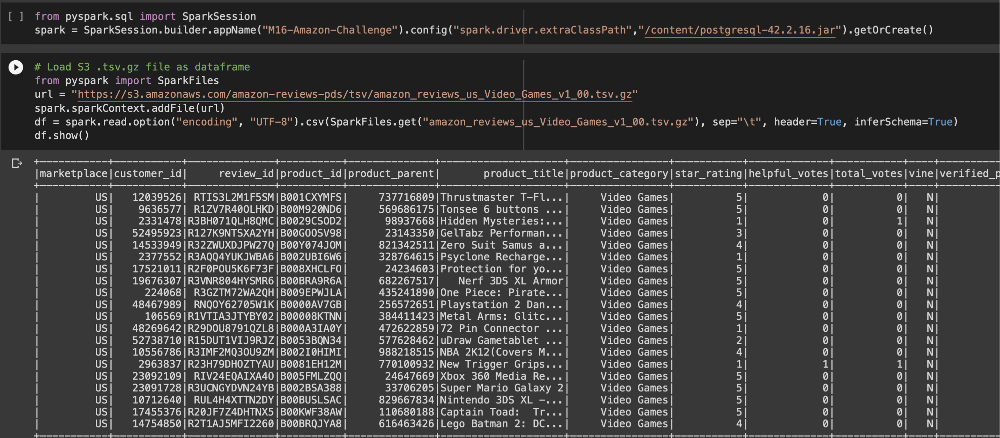
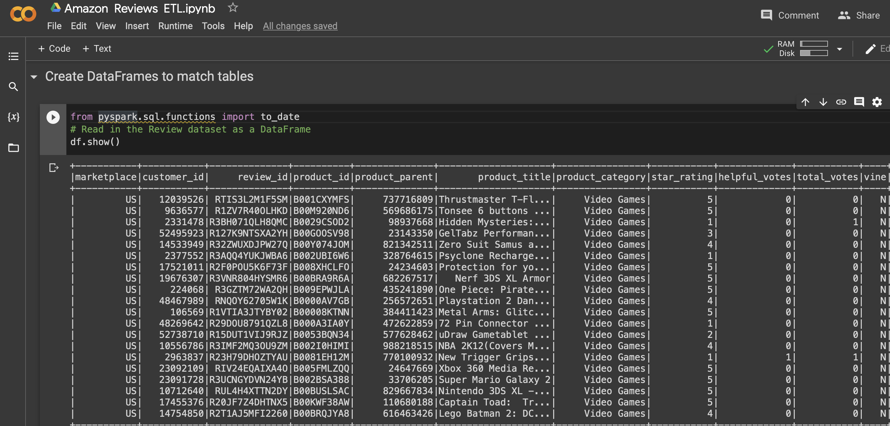
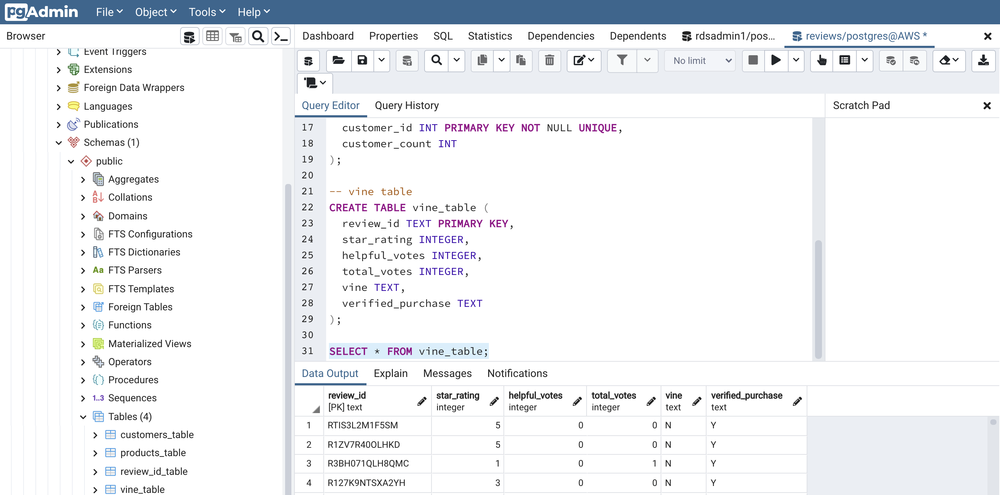

# Amazon Vine Analysis

## Overview
This project is to analyze Amazon reviews written by members of the paid Amazon Vine program. The Amazon Vine program is a service that allows manufacturers and publishers to receive reviews for their products. Companies pay a small fee to Amazon and provide products to Amazon Vine members, who are then required to publish a review.

## Approach
- Out of approximately 50 datasets, I chose to analyze video game reviews. 
- Use PySpark to perform the ETL process to extract the dataset from an S3 bucket, transform the data, connect to an AWS RDS instance, and load the transformed data into pgAdmin. 
- Use PySpark to determine if there is any bias toward `5-star reviews` from Vine members in the dataset. 

## Software and tools for analysis

- [Google Colab](https://colab.research.google.com)
- [pgAdmin](https://www.pgadmin.org)
- [PySpark](https://spark.apache.org/docs/latest/api/python/getting_started/install.html)
- [Java 8](https://www.oracle.com/java/technologies/downloads/)
- [AWS RDS](https://aws.amazon.com/rds/)
- [ VS Code](https://code.visualstudio.com/download)

## ETL

- Extraction of videogame data from S3 bucket


- Transformation of data in to dataframes using PySpark


- Loading of data into Postgres tables


## Analysis

### Filtering the dataset for total_votes greater than or equal to 20

- The data was filtered to reviewers with more than 20 total votes, on verified purchases. This provides a more consistant Vine program trends.
- The filtered total is `65379` reviews

```
vote_count = df.filter("total_votes >= 20")
vote_count.show()
vote_count.count()
```

### Filtering for reviews where the number of helpful_votes equal to or greater than 50%.

- Next, the verfied data was filtered to find the vine reviews with the highest percentage of most helpful votes.

```
new_table = vote_count.filter(vote_count["helpful_votes"]/ vote_count["total_votes"]>= 0.5)
new_table.show()
new_table.count()
```
- This filter decreases the data by `38%` at `40565` votes. However, by using the number of helpful votes ratio to total reviews, the new data set is a better measure of the reach of total reviews.


## Results
- The data shows that there are `94` total Vine program videogame reviews and non-Vine reviews total `40,471`. 
- The Vine program reviews makeup `.2% ` of reviews with `total votes over 20` and a `helpful votes ratio of 50 % or above. This shows that the impact of Vine program videogame reviews are significantly lower than other Amazon users.

How many Vine reviews were 5 stars? How many non-Vine reviews were 5 stars?
- The data shows that of the 94 Vine program videogame reviews, `51%` are `five-star` reviews. A total of `48` reviews.
- Conversely, non-Vine had a conservative more conservative trend,  with 5-star reviews at only `39%`  of total reviews.
- This shows a bias toward 5-star videogame reviews in Vine program participants.
